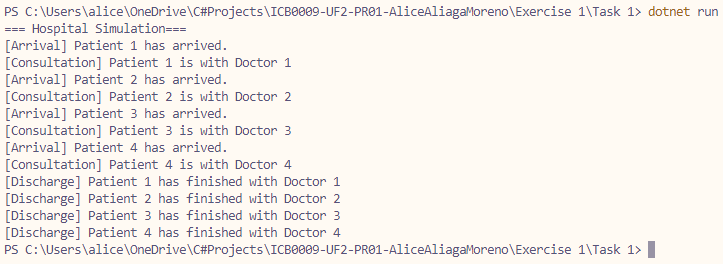

# Exercise 1 - Task 1: Medical Consultancy
This program simulates four patients arriving at a hospital. Each of them arrives two seconds after the previous one. 

These four patients will be progressively processed into one of the four consultancy rooms available, each consultancy lasting 10 seconds and finally releasing the patient and making the room available again. 

SlimSemaphor and Threads were used to simulate the simultaneous ordered attendance.

## Requisites
* Four patients must arrive at the hospital
* Four consultancy rooms and doctors must be availabe
* Each patient is to be admited inmediately if a room is available
* Doctors will take exaclty 10 seconds per consultancy

## Classes and methods

### Class Hospital
* Represents the entire hospital, thus has the `main` method
* Implements `SimulatePatientArrival` with a variable quantity of patients

### SubClass ConsultingRooms
* Represents the Consulting Rooms section of the hospital
* Sets a quantity of available rooms and doctors, and makes the maximum possible simultaneous consults the smallest of this two values
* Includes the `AttendPatient` method which will perform the actions required for the attendance

## Q&A
### 1. How many threads have been executed in your program? Why?
That would be exactly four threads. This can be certain because we launch the `SimulatePatientArrival` method with `patientQuantity = 4` and thus the `for` loop that generates the Threads will only exactly loop four times

### 2. Which patient enters a consultancy room first? Why?
That would be patient one, because this patient enters when all rooms are available, thus we inmediately assign one to this person. Since each patient comes every two seconds, there is more than enough time for the first patient to be handled accordingly before the second one comes.

> tldr; The first patient to enter will be the first to enter a consultancy room

### 3. Which patient exits a consultancy room first? Why?
This would also be patient one, because it is the first patient that has entered a room, and since each patient enters every two seconds, this person is two seconds ahead of the second one to enter.

> tldr; any patient can exit first but a there are fixed consultancy times, the first one to enter a room will always be the first one to exit

## Output
