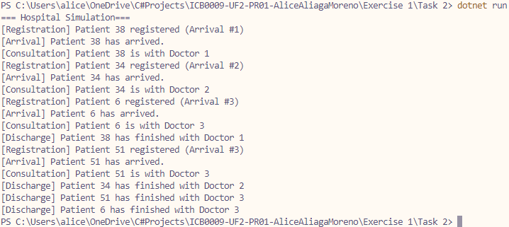

# Exercise 1 - Task 1: Medical Consultancy
This program simulates a more realistic patient management and attendance system. Patients are created with random but unique IDs and are assigned a random time of consultation.

This provides a more erratic entry of patients and thus the system has been modified accordingly

## Requisites
* On entry, patients are given:
    * A unique ID from 1 to 100
    * A hospital arrival order number
    * A random consultancy time ranging from 5 to 15
    * A status (Awaiting | In consultancy | Discharged)
* Patients should be assigned the first room and doctor available and should elapse exactly their consultancy time

## Classes and methods
### Class Hospital
* Added a static `List<Patient>` *(see Class Patient below)* to store all registered pattients
* Added a static method `RegisterNewPatient` that intakes the aforementioned list and returns it updated. It creates a new patient with the adequate **Requisites**
* The consulting room sublcass has been updated to remove the patient with the ID of the current patient from the list and thus, discharge it

### Class Patient
* Defines a *data* class that will create a `Patient` object with every **Requisite** and it's getters and setters
* Applies a constructor that can initialise the patient

## Q&A
### 1. Which patient exits consultancy first? Elaborate.
There are a few variables two this:

Since the patients use RNG from 5 to 15 seconds of consultancy time, it is probably most obvious to assume that the shortest time of consultancy will always be the first exit. However, since patients do only enter every two seconds, there will be a slight advantage for the first entry *Arrival #1*.
This effectively makes the shortest possible time be an *Arrival #1* that gets a 5 seconds time.
Of course, if *Arrival #1* gets 13 seconds, *Arrival #2* gets 15 seconds and *Arrival #3* gets 5 seconds, arrival three will be discharged first.

> tldr; It is factored by the RNG mostly, but the shortest possible discharge time is *Arrival #1* with a lucky RNG of *5 seconds*.

## Output
