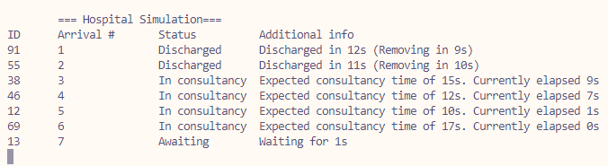
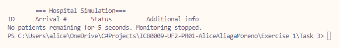

# Exercise 1 - Task 3: Monitor changes

## LATENCY ALERT!
If text is displayed poorly, modify "Thread.Sleep(1)" at the end of MonitorPatientStatus() and change it to "*500*". One millisecond was used as in my computer it prompts non-blinking visuals.

## Requisites
All previous excercise requisites, plus:
* A monitoring CLI should be shown and updated with the information relative to the patient
* Extra relevant information is to be added to the monitor to enrich the quality of monitoring

## Classes and methods
### Class Hospital
* Create a lock object to lock the *patientList* on write/update queries
    * Lock on RegisterNewPatient
    * Lock on remove all patients that need to be removed
* Create MonitorPatientStatus method:
    * Calculate timings extensively
    * Based on status, use timing calculations to output current information
    * Add patients to removal list if they spent > 10 seconds as Discharged
    * Check wether more than 5 seconds pass without any new entry and stop the program if so
    * Update every 0.5 seconds for rich information update
* Update ConsultingRooms
    * Patients are set as `Status = "Discharged"` but not removed from the list
    * `Patient.StartConsultancyTime` and `Patient.DischargeTime` are set to properly carry out timing information upon monitoring
    * [BUGFIX] ConsultingRoom performs Wait() before setting *In consultancy* status to avoid bug where patients would not be shown as *Awaiting*

### Class Patient
* Added `DateTime` properties for time calculations
    * ArrivalTime: registers when the patient is registered
    * StartConsultancyTime: registers when the patient starts being consulted
    * DischargeTime: registers when a patient is discharged
* Constructor includes *ArrivalTime*

## Q&A
### 1. Did you choose to visualize extra information? Why? Elaborate on what other information could be useful.
I actually decided to show the information in the following fashion:
   
* While `Awaiting`, add how many seconds the patient has waited
* While `In consultancy`, add the expected consultancy time and the time elapsed
* While `Discharged`, add how much time it took and add a counter to say in how much time the patient will be removed from the list

This extra information is extremely useful to snapshot a more accurate picture of the current status as it provides rich information on everything that's going on at the moment.

## Output

