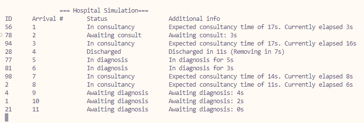

# Exercise 2 - Task 2: Diagnosis Units

## LATENCY ALERT!
If text is displayed poorly, modify "Thread.Sleep(1)" at the end of MonitorPatientStatus() and change it to "*500*". One millisecond was used as in my computer it prompts non-blinking visuals.

## Requisites
All previous excercises requisites, plus:
* Patients should enter Consults by arrival number priority

## Classes and methods
### Class Hospital
* Make *Arrival #* be incremental so arrivals are always unique
* [BUGFIX] While monitoring, iteration now occurs over copy of the patientList so that there are no issues when deleting a discharged patient

### Class ConsultingRooms
* Added SortedList named `consultQueue` of *Arrival #* and *Patient* that automatically sorts patients by lowest ID
* Added `queueLock` for locking the queue accordingly
* Patients being processed in consultancy are added to the `consultQueue`
* While a patient hasn't been dispatched into a consult, do:
    * Check if the patient is the lowest ID in the queue (first one) and also if there is an available consult
    * If so, give them a consult and remove them from queue

## Q&A
### 1. Explain the chosen solution and why you chose it
My solution creates a queue that is self updated with every patient that is awaiting for consult, and automatically sorts them by *Arrival #*. This is a very easy way of realising the sorting and thus we only need to check if the patient is first in the list before letting it into the consult. I believe this solution might be on the simpler side than manually sorting over numbers and thus decreases latency.

### 2. Design a different solution to the one you chose
We could have created another `List<Patient>` and applied manual methods to order it each time we check wether the patient should enter a consultancy or not. This would significally increase latency so it is definetly not prefered.

## Output
We can clearly see that *Arrival #* 1 was prioritised before #2:

