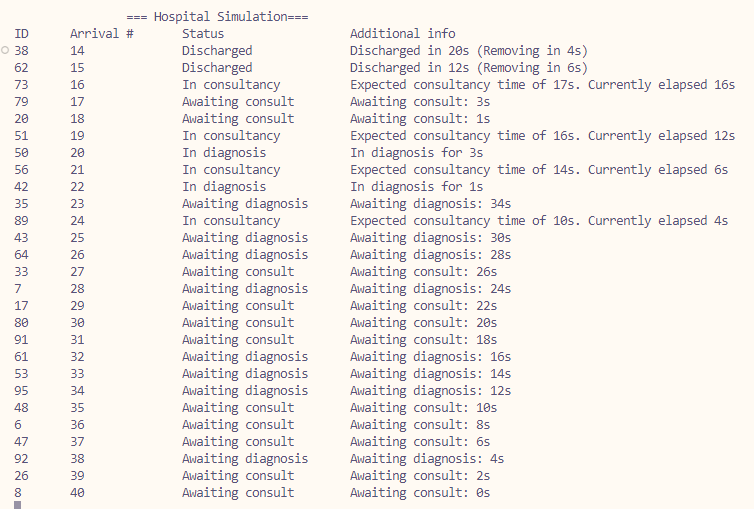

# Exercise 2 - Task 3: Diagnosis Units

## LATENCY ALERT!
If text is displayed poorly, modify "Thread.Sleep(1)" at the end of MonitorPatientStatus() and change it to "*500*". One millisecond was used as in my computer it prompts non-blinking visuals.

## Requisites
All previous excercises requisites, plus:
* 20 patients must enter simultaneously
* An intermediate status after *Diagnosis* and before *In consultancy*

## Classes and methods
Nothing was done as my code **already behaves like this**, as it was performed in previous excercises because the approach was seen as more ordered (full complete statuses) and also more visual to assert that behaviour was as intended (using 20 patients to properly see queuing happened as desired).

In fact, my code *__already__* will run until a few seconds after the last patient has arrived for better performance and richer behaviour.

## Q&A
### 1. Explain your rationale for writing this code and provide an alternative solution
Well this code had already been performed exactly as required in this excercise so there's no rationale for it, nor is there an alternative... This was solved in excercise 2, tasks 1 and 2 because in order to ensure correct behaviour of the patients, 20 patients was chosen as a good number for observation.

### 2. Do patients must wait for consultancy in arrival order? What tests did you perform?
Patients do enter Consults by their arrival order. This was done in Task 2 to prioritize patients that had arrived to the Hospital before and were awaiting for a consult, as otherwise they would be given the spot in backward order of arrival and that meant higher waiting times for earlier patients. Thus, the `SortedList<int, Patient>` did the trick.

A continuous output of patients is an incredibly good test for seeing that effectively this works as intended.

## Output
Here's the output for attending 50 patients:
