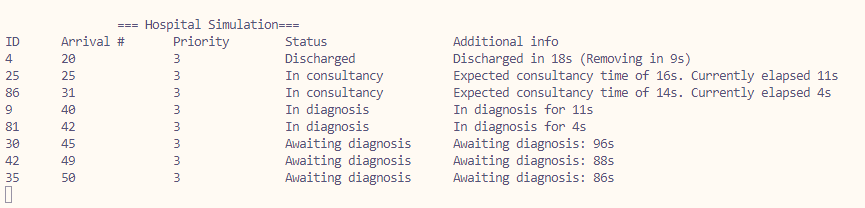

# Exercise 2 - Task 3: Diagnosis Units

## LATENCY ALERT!
If text is displayed poorly, modify "Thread.Sleep(1)" at the end of MonitorPatientStatus() and change it to "*500*". One millisecond was used as in my computer it prompts non-blinking visuals.

## Requisites
All previous excercises requisites, plus:
* Add an urgency level (RNG from 1 to 3) to each patient when they enter
* 1 = Emergency, 2 = Urgency, 3 = General
* Patients must be attended by priority order
* If multiple patients of the same urgency level are waiting, queue them by number of arrival

## Classes and methods
### Hospital.cs
* Upon registry patients are given a priority based on (RNG from 1 to 3)
* Add Priority into monitoring
* [BUGFIX] fix monitoring tabulations for readability

### ConsultingRooms.cs
* SortedList is changed to a SortedSet that will include a custom comparer for checking priority order
* When checking the queue by `consultQueue.First().ArrivalNumber`, we get the first arrival number from the set that is automatically sorted by Priority

### DiagnosisRooms.cs
* Diagnosis room aquires the same sorting mechanism as **ConsultingRooms.cs**

### Patient.cs
* Added Priority attribute and included into the constructor

## Q&A
### 1. Explain the rationale behind your code and give an alternative answer. Why did you choose yours?
The rationale behind my code has been to implement the smartest simplest lest cross class changing solution.
That is why I simply added the required code for adding the priority and then focused on the sorting mechanism.

A *SortedSet* is by far the best choice as I could overload the Sorting compare and make it so that it automatically sorts patients by Priority. Since we can get the First() of ArrivalNumber, that means we can very simply get the first ID from the highest current existing priority at all times.

We could handle this in a more manual method via manually ordering a `List<Patient>` but this would be inneficient because we need to add a lot of boilerplate for that to work, vs a very simple bolerplate for overloading the Comparer of `SortedSet<Patient>`. 

This is why I chose the aforementiend solution.

## Output
For this trial we used 50 patients.

Here we can see that higher prio later arrived patients will get consultancy before earlier arrived lower priority patients. Also we can see that lower priority patients aren't given diagnosis until they are the last.

We can inded observe that by the end of the code, only priority 3 patients remain

