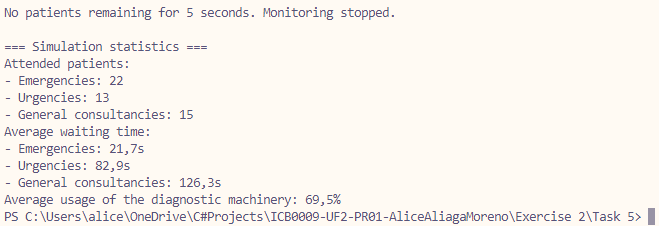

# Exercise 2 - Task 5: Diagnosis Units

## LATENCY ALERT!
If text is displayed poorly, modify "Thread.Sleep(1)" at the end of MonitorPatientStatus() and change it to "*500*". One millisecond was used as in my computer it prompts non-blinking visuals.

## Requisites
All previous excercises requisites, plus:
* At the end of the simulations, show these statistics:
    * Total of patients attended by priority
    * Median wait time per patient per priority
    * Average usage of diagnostics machinery

## Classes and methods
### Hospital.cs
* Added dictionaries to hold wait times and patient counts by priority
* Added total diagnoses attribute
* Added beginning and ending simulation times to calculate elapsed wait times
* When about to delete a patient, reguster waiting data
* Update monitor to output all data at the end of the simulation
* Add helper method to print mean wait time of specific priority
* Add helper method to get priority names
* Add helper method to add a waiting time into the dictionaries

### DiagnosticRooms.cs
* Increment the Diagnoses attributes of hospital every time a diagnostic happens

## Q&A
### 1. Can you explain your code and why you chose to do it like so?
Indeed. The code is based on creating two dictionaries to hold waiting times and patient count, all by priority.
We then set the simulation current time and make use of the DateTime properties of Patient in order to calculate the elapsed times while waiting.

For this we use the helper methods, one prints the median of all entries of a priority in the waiting times dictionary, the other returns the name of each priority (kind of like an ENUM) and the last one just adds the wait time into the WaitTimesByPriority dictionary and also ads the patient to PatientCountByPriority.

## Output
For this trial we used 50 patients: (Decremented patient spawn time to 500 millis to not die in the process of waiting)

