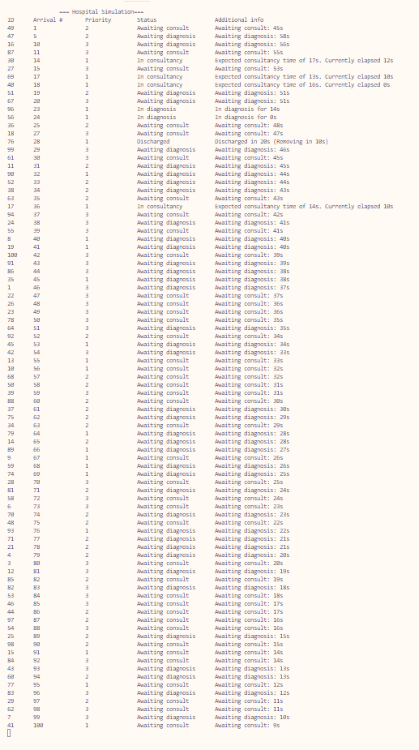

# Exercise 2 - Task 5: Diagnosis Units

## LATENCY ALERT!
If text is displayed poorly, modify "Thread.Sleep(1)" at the end of MonitorPatientStatus() and change it to "*500*". One millisecond was used as in my computer it prompts non-blinking visuals.

## Requisites
All previous excercises requisites, plus:
* Create a random patient generator
* Every two seconds it will generate a patient with different consultancy times, priority and wether it requires diagnostic or not

## Classes and methods
No changes were made as since the very beginning my code implemented a random patient generator and changes were directly made to it to adapt for changes such as priority.

**Program.cs** can launch the simulation with any number of chosen patients already.

## Q&A

**Use the machine with N=50, 100 and 1000 patients**

### 1. Is it up to requisites? 
Yes, indeed.

#### Proof
> See ouput below

#### Explanation
I believe this code is entirely up to requisites as a lot of extra work went into ensuring quality consistency and a bunch of tasks were done in advance. As seen in the output below, no single incorrect behaviour is happening as per criteria (for example a much newerly admited patient with Emergency priority is admited before any Urgency or General consultancy priority patients).

### 2. Which unpredicted behavior do you find?
None at all.

#### Proof
> See output below

#### Explanation
Since a bunch of time went into curating this behaviours, you might see corrections in the revisions done to the code in between mayour uploads of code to this git, and others were noticed while making the main testing before uploading big code blocks. By thorouhgly checking the patients and minding early to test with much more patients (20, 50, 100), the awaiting timings and priorities could be observed in detail.

### 3. How would you adapt your solution?
I believe it is already up to standard.

#### Explanation
No need for adapting as this code was tested for larger volumes since early Excercises and Tasks

## Output
Trial with 100 patients with patient admittal speed at 500 millis to not die waiting:
